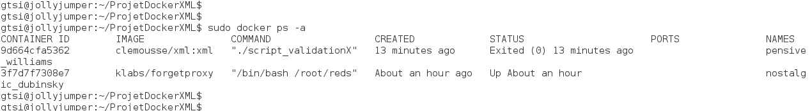

# Application permettant de valider un XML et son XSD sur une machine supportant Docker.

Pour utiliser les commandes telles quelles sans <code>sudo</code>, il vous faut être en root ou être dans un [Docker Group](https://docs.docker.com/engine/installation/debian/#giving-non-root-access).

##1. Installation de Docker

Rendez-vous sur le site **<https://docs.docker.com/>** et choississez l'installation de Docker adéquate en fonction de votre système d'exploitation.

Docker ne tourne que sous Linux et les configurations requises sont les suivantes :

* Debian Wheezy et plus
* Kernel 3.10

Cependant, on peut installer une Docker ToolBox pour créer une machine virtuelle Linux qui permettra l'accès à Docker sur Mac OS X et Windows en respectant les configurations ci-dessous :

* Mac OS X 10.8 Mountain Lion et plus.
* Windows 7 et plus

de façon générale vant de puller une image, si votre Docker fonctionne derrière un proxy, pensez à le configurer :

* un exemple sous Debian Wheezy, dans le répertoire /etc/default/, il s'agit du fichier **docker** :

Pour pouvoir par la suite travailler avec l'image dont vous aurez besoin pour lancer un container qui validera vos fichiers xml/xsd, il vous faut créer un environnement qui la rend "portable", c'est-à-dire utilisable quelque soit votre proxy et son port.
Pour cela, vous devez lancer la commande suivante : 

><code>docker run -d --net=host --privileged -e http_proxy=http://**myproxy**:3128 -e https_proxy=http://**myproxy**:3128 klabs/forgetproxy</code>

Où vous remplacez le **myproxy** par votre propre proxy.

Pour plus d'explications sur l'image **[klabs/forgetproxy](https://hub.docker.com/r/klabs/forgetproxy/)** que vous avez ainsi lancée dans un container en tâche de fond (<code>-d</code>), rendez-vous [ici](<http://blog.kaliop.com/blog/2015/05/26/docker-dans-la-vraie-vie-les-parties-delicates/#ancre1>) et [là](https://hub.docker.com/r/klabs/forgetproxy/)

*NB-IMPORTANT : Une fois votre travail terminé, il vous faudra rétablir les règles de proxy par défaut avant de supprimer votre container :*

>*<code>docker run --net=host --privileged klabs/forgetproxy stop</code>*

##2. Création du dockerfile

Voici une vue du dockerfile détaillé qui a permis de construire l'image.

Voici la commande qui a permis de construire l'image à partir du dockerfile :
on se trouve actuellement dans le répertoire contenant le dockerfile (cf => <code>.</code>) et l'on tag notre image clementine:xml (<code>-t</code>).

><code>docker build -t clementine:xml .</code>

... pendant ce temps, les mises à jour se font et libxml2 s'installe dans le container...

... et l'image est bien là !

Le lien vers l'image sur Docker Hub : **<https://hub.docker.com/r/clemousse/xml/>**.
Vous pouvez pour la suite l'utiliser directement à partir de Docker Hub.

##3. Création du container et exécution de la validation xml

><code>docker run -v **CheminFichier**:/home/xml clementine:xml ./script_validationXML.sh **FichierXML**</code>

**CheminFichier** contient le chemin absolu de vos fichiers xml et xsd qui doivent se situer tous les deux dans le même répertoire

Grâce à <code>-v</code>, toutes les données écrites dans **CheminFichier** seront copiées dans /home/xml dans le container. Docker a ainsi monté le répertoire de votre machine **CheminFichier** sur /home/xml dans le container pour que les deux puissent communiquer entre eux.

**clemousse/xml:xml** est le nom de l'image disponible sur Docker Hub => repository:tag

**./script_validationXML.sh** correspond à l'éxecution du script <code>script_validationXML.sh</code>.
**FichierXML** est le nom unique pour vos deux fichiers xml, qui constitue le paramètre qui sera donné à la variable $1. (cf. dockerfile).

Un exemple :

><code>docker run -v /home/gtsi/ProjetDockerXML:/home/xml clemousse/xml:xml ./script_validationXML.sh annuaire</code>

... et le container est bien créé en effet ! Et le fichier xml validé de surcroît ! Quelle chance !

##3. Sources diverses (parmi tant d'autres...)

###Sur le fonctionnement général de Docker :
  - <https://docs.docker.com/>
  - <https://www.wanadev.fr/>

###Pour les problèmes de proxy : 
  - <http://blog.kaliop.com/blog/2015/05/26/docker-dans-la-vraie-vie-les-parties-delicates/#ancre1>

###Pour l'installation et l'utilisation de xmllint :
  - <https://packages.debian.org/fr/sid/libxml2-utils>
  - <http://blog.touv.fr/2005/06/xmllint-un-couteau-suisse-pour-les.html>
  - <http://xmlsoft.org/xmllint.html>
  - <http://www.developpez.net/forums/d172298/autres-langages/xml-xsl-soap/valider/contributions-valider-xml-xsd/>
  - <http://flowingmotion.jojordan.org/2011/10/08/3-steps-to-download-xmllint/>

###Pour construire un dockerfile :
  - <http://putaindecode.io/fr/articles/docker/dockerfile/>
  - <http://blog.ippon.fr/2014/10/20/docker-pour-les-nu-pour-les-debutants/>

###Pour le langage shell et la construction du script : 
  - <https://openclassrooms.com/courses/reprenez-le-controle-a-l-aide-de-linux/introduction-aux-scripts-shell>

